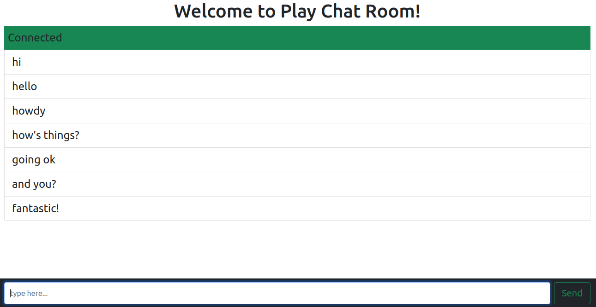

play-scala-seed
===============

An example playframework scala app with docker integration using sbt-docker plugin

### How to push in docker hub
Please make sure you are loggedin in docker hub. Do login `docker login` if necessary.

    sbt dockerBuildAndPush

### How to Run

In SBT, just run `docker:publishLocal` to create a local docker container. 

To run the app in docker, run `docker-compose up`

While running, try opening a new browser tab and visit http://localhost:9000
